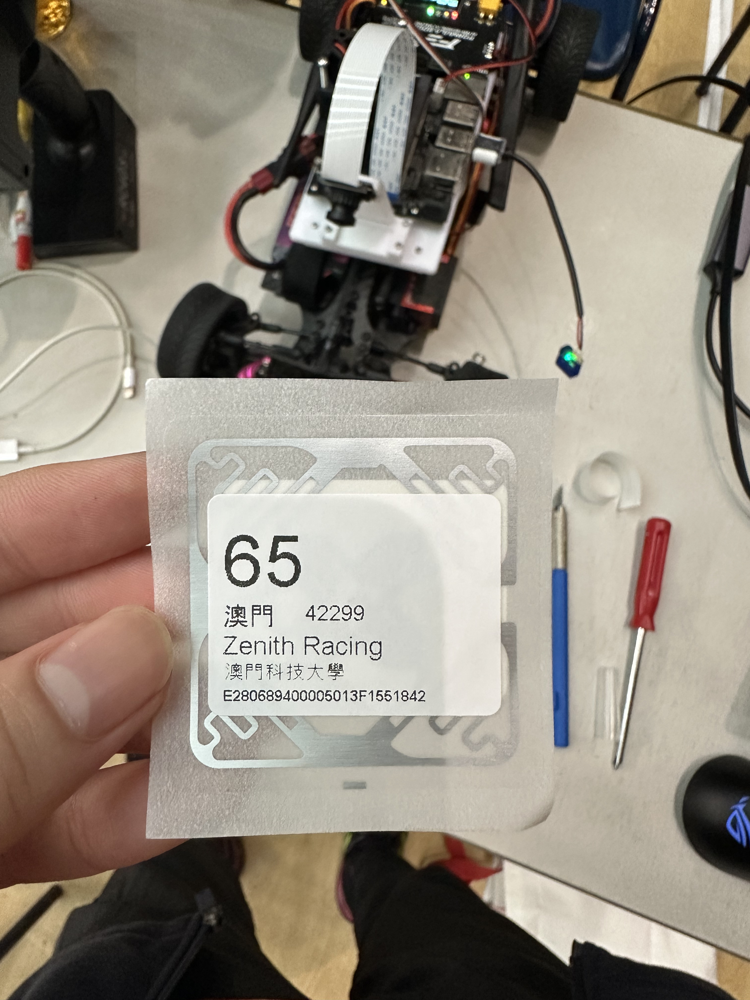
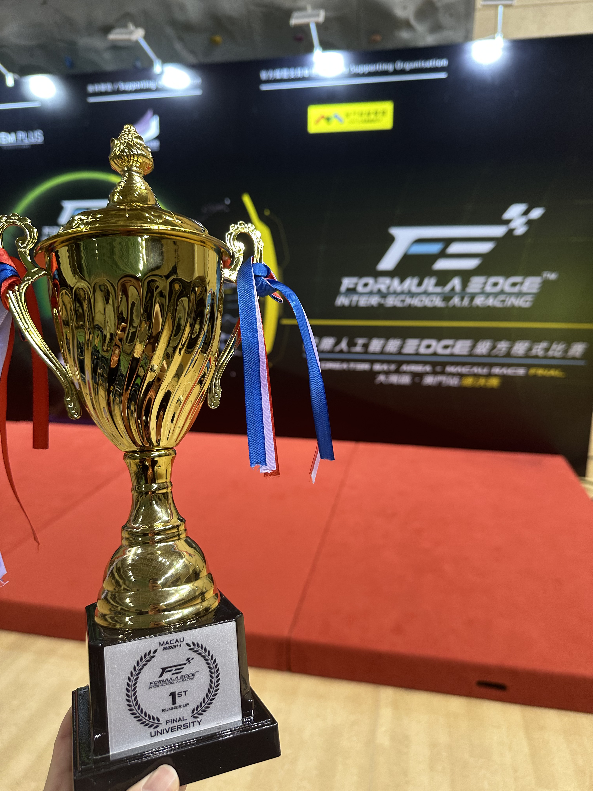
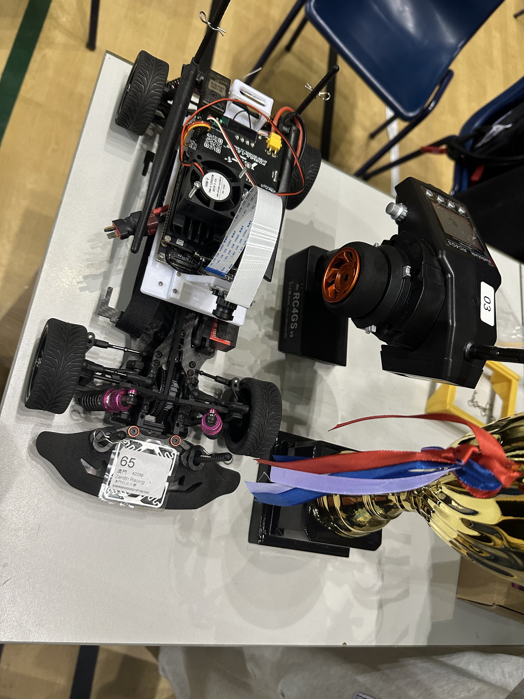
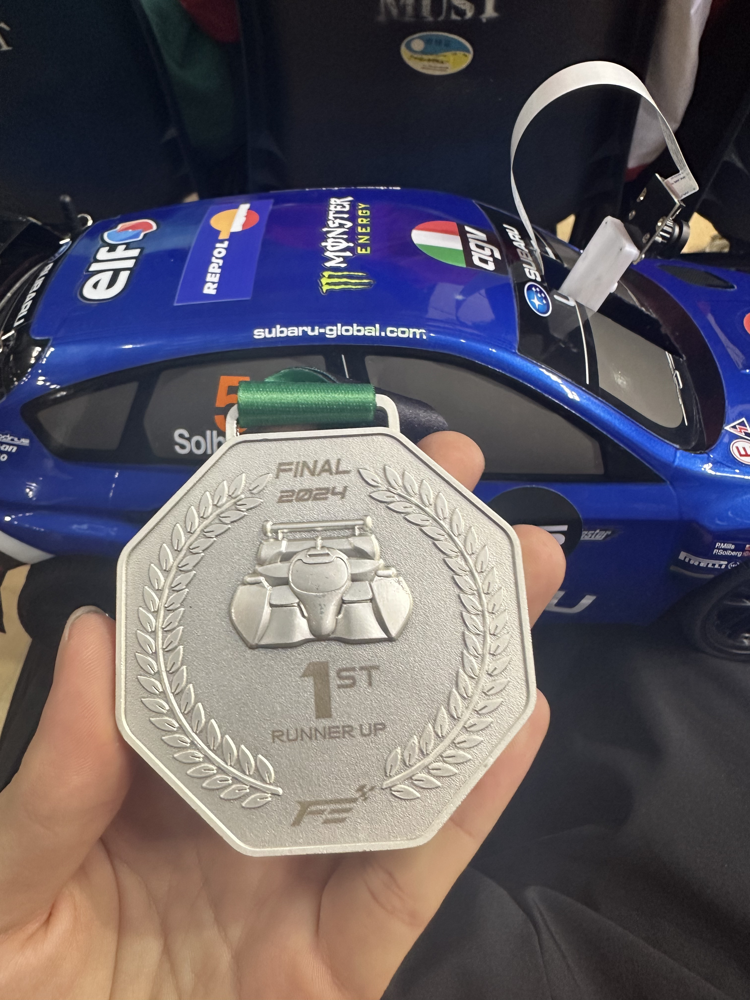
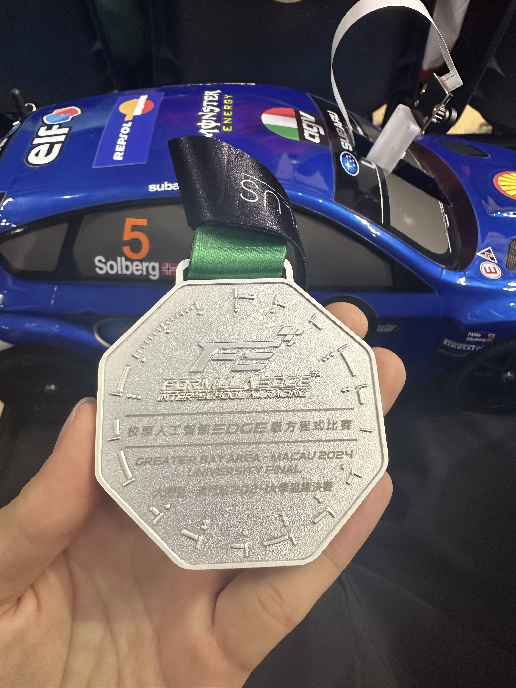
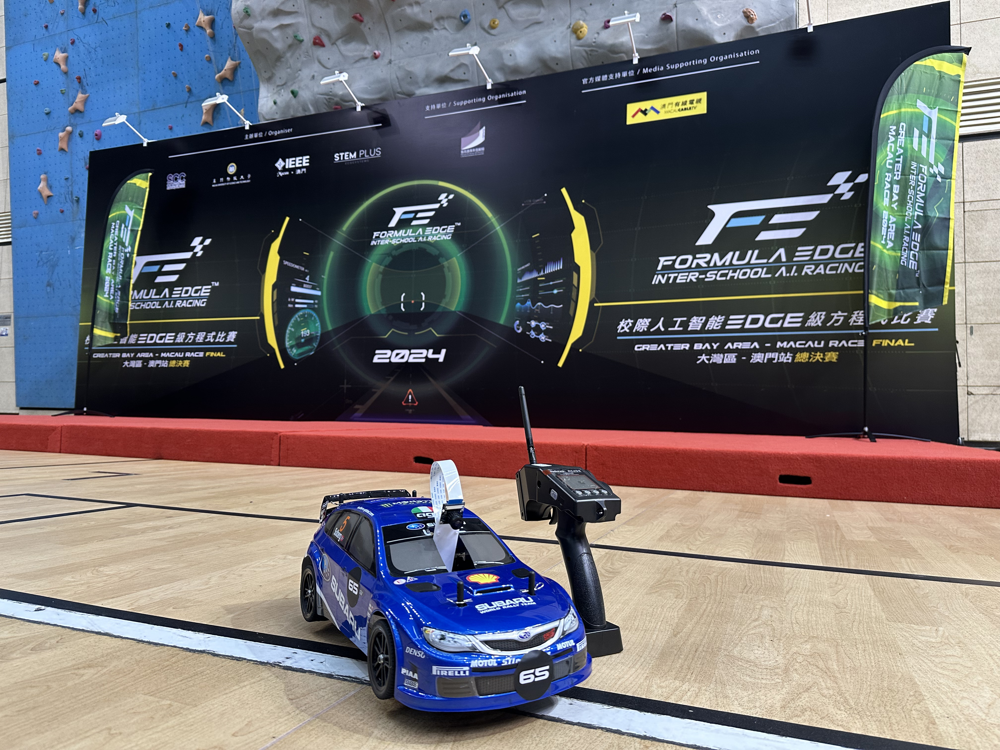
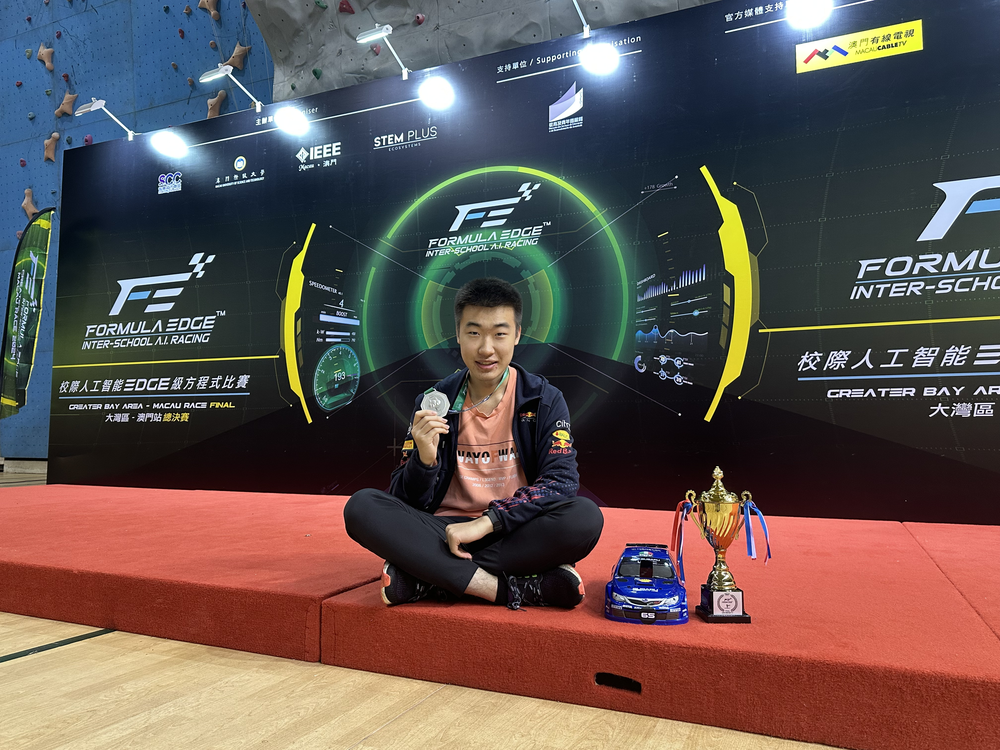
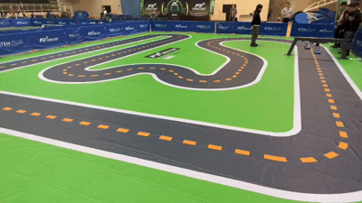

# Formula Edge 2024 Tutorial & Race Report

> 🚗 Second Place at Macau Formula Edge 2024  
> Autonomous JetRacer build, 3D‑printed hardware, training pipeline and real‑race insights.

---

<!-- filepath: d:\code\github_repositories\FormulaEdge-Macau-2024\README.md -->
<table>
  <tr>
    <td></td>
    <td></td>
  </tr>
</table>
Team name: TENITH RACING

---

## Image Gallery

### Photos

<table>
  <tr>
    <td></td>
    <td></td>
  </tr>
</table>

<table>
  <tr>
    <td></td>
    <td></td>
  </tr>
</table>

<table>
  <tr>
    <td></td>
    <td></td>
  </tr>
</table>

### GIFs

Qualificatin trials

A major mistake in the first round of the final (run out of the track)

## Badges

-   
- 

---

## Table of Contents

1. [Introduction](#introduction)  
2. [Repository Structure](#repository-structure)   
3. [Hardware & 3D‑Printing](#hardware--3d-printing)  
4. [Core Motion Code](#core-motion-code)  
5. [Race Experience (Summary)](#race-experience-summary)  
6. [License](#license)  

---

## Introduction

A guide to our second‑place JetRacer entry at Macau Formula Edge 2024:

- 3D‑printed camera mounts & chassis brackets
- Competition rules document  
- Data labeling, model training pipeline & hyperparameters
- Some database as examples ( you may not use it since we face diff tracks and conditions)  
- In‑race throttle strategy & battery management

**_This race is different from most intelligent tracking cars, since it requires some contacts and overtakes between you and your rivals._**

**_The way you label the image will influence the performance on the track, you not only need to label some shortest paths, but also need to decide how you cars battle with others, the reason why we hasn't take the Champinship is because after our car successfully overtake the rival, their car just "pit" our car just like the American police did._**

---

## Repository Structure

             
